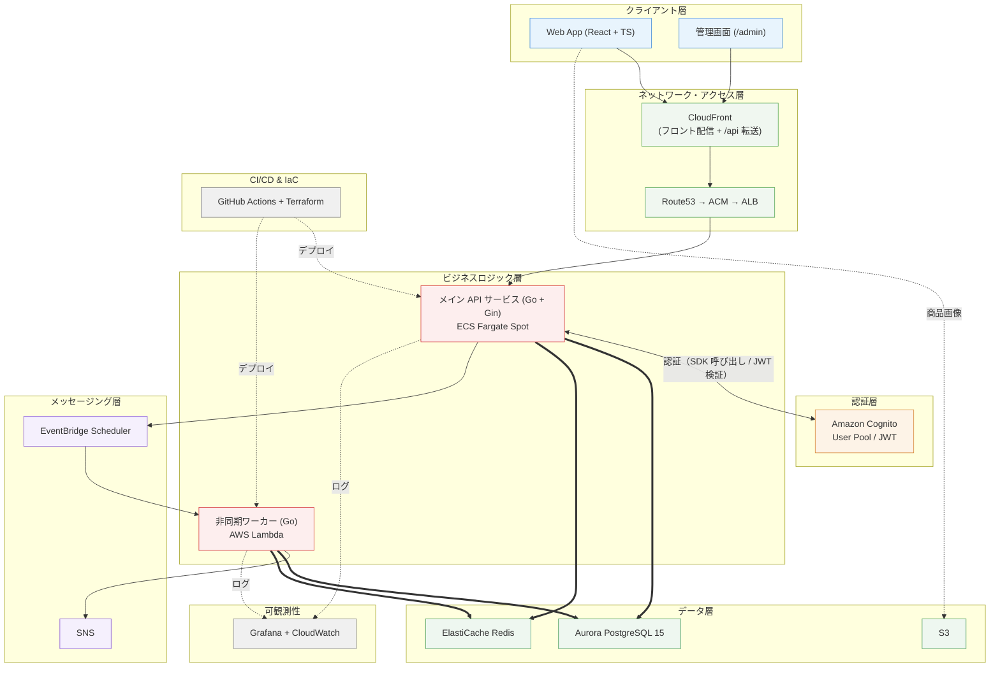

# 🏗️ FlashBuy — 大量同時アクセス対応 フラッシュセール・抽選販売プラットフォーム

[日本語] | [中文](README_zh.md)

> **プロジェクト概要**：本プロジェクトは、大量同時アクセス（高負荷）環境を想定して設計された、フラッシュセール（先着購入）および抽選販売を統合したシステムです。主要な技術検証ポイントは、Redis Lua スクリプトによるアトミック在庫減算（超売り防止）、抽選開票の Lambda 定期バッチ処理、Terraform によるモジュール化 AWS インフラ管理です。

---

## 1. システム全体アーキテクチャ図



> 注：上図は**目標アーキテクチャ**。
>
> データベース：図中の Aurora は**本番進化の目標**。現在は **RDS PostgreSQL（provisioned）** を採用（選定理由は §5.1）。フロントは CloudFront で配信する（静的ホスティング + `/api` の ALB 転送）。Route53 / ACM は目標の接続形態。非同期ワーカー（Lambda）は抽選開票・注文タイムアウト等のバッチ処理を担う（設計は §6）。S3 は商品画像の保存に使用する。

---

## 2. 技術スタック

### 2.1 フロントエンド

- **Core**: React 19, TypeScript, Vite
- **Styling**: Vanilla CSS, Tailwind CSS
- **State & Data**: Zustand, TanStack Query (React Query)
- **Utilities**: Day.js, Axios

### 2.2 バックエンド (Go)

- **Framework**: Go 1.26, Gin
- **Database Access**: sqlx, PostgreSQL（現在は RDS PostgreSQL / 本番進化は Aurora、§5.1 参照）
- **Cache & Storage**: go-redis/v9 (Redis Lua Scripting)
- **AWS Integration**: aws-sdk-go-v2
- **Logging**: Zap（構造化ログ）

### 2.3 クラウド・インフラ (AWS)

- **Compute**: ECS Fargate Spot, AWS Lambda (Go Runtime)
- **Database & Cache**: PostgreSQL（**現在: RDS provisioned** / 本番進化: Aurora Serverless v2、§5.1 参照）, ElastiCache Redis
- **Storage & Lifecycle**: S3（商品画像。ライフサイクル階層化は §5 参照）
- **Messaging & Event**: SNS Standard, EventBridge Scheduler
- **Network & Security**: ALB, Route53, ACM, Amazon Cognito
- **Deployment & Monitoring**: CodeDeploy, CloudWatch, Grafana

### 2.4 IaC & CI/CD

- **Terraform** (モジュール化構成, S3 Remote State + S3 ネイティブロック `use_lockfile`)
- **GitHub Actions** (ビルド、テスト、ECRプッシュ、CodeDeploy ブルー/グリーンデプロイ、Terraform反映)

---

## 3. コアデータフロー

### 3.1 フラッシュセール（先着購入）フロー

```
[ユーザー] 「今すぐ購入」をクリック
   ↓
[フロントエンド] リクエスト送信（処理中はボタンを無効化）
   ↓ POST /api/v1/flash/buy
[API - Gin]
   ① Cognito JWT 認証チェック
   ② Redis Lua によるアトミック在庫減算（同期・超売り防止）
      ├─ 在庫なし → 「売り切れ」を返却
      └─ 成功 → 継続
   ③ トランザクションで注文作成 (UNPAID, expires_at = now + 15min) + DB 在庫 -1
   ④ at(expires_at) ワンタイム Schedule を登録（失敗時はログのみ、cron がバックアップ）
   ⑤ レスポンス { orderId, status: "QUEUED" } を返却
```

> **同期設計の根拠**：購入パスは同期で完了する。在庫減算は Redis の単一スレッド原子性（超売り防止の基盤）に依存するため、メッセージキューによる遅延処理には置き換えられない。また、ユーザーは購入結果を即座に知る必要があり、非同期化はポーリングやプッシュの複雑さを招くだけである。注文タイムアウト取消と在庫復元は独立したバッチ処理であり、デプロイ形態は §6 参照。

### 3.2 抽選フロー

```
[EventBridge Scheduler] draw_at 到達時にトリガー（抽選作成時に一回限りの Schedule を自動登録）
   ↓
[Lambda - LotteryDrawer]
   ① 応募者リストを取得
   ② crypto/rand による安全な乱数生成
   ③ Fisher-Yates アルゴリズムによるシャッフル
   ④ 当選者の抽出と DB へのバッチ書き込み（当選 UNPAID + 72時間 pay_deadline、残り LOST）
   ⑤ SNS トピック発行 (lottery.drawn)
```

---

## 4. プロジェクト構造

```
flashbuy/
├── frontend/                       # React + TypeScript フロントエンド
│   ├── src/
│   │   ├── components/             # 共通コンポーネント (TicketCard, PaymentMockModal, Countdown, OrderStatusModal, layout)
│   │   ├── hooks/                  # カスタムフック (useCountdown)
│   │   ├── pages/                  # 画面 (Home, FlashList, Flash, LotteryList, Lottery, Search, MyPage, Admin, Login, Register)
│   │   ├── services/               # API 通信層 (api.ts, request.ts)
│   │   ├── stores/                 # Zustand 状態管理 (authStore, orderStore)
│   │   └── types/                  # TypeScript 型定義 (index.ts)
│   └── Dockerfile                  # フロントイメージ
├── api/                            # Go API メインサービス (Gin)
│   ├── cmd/server/                 # エントリポイント (main.go)
│   ├── config/                     # 設定読み込み (viper)
│   ├── controllers/                # HTTP コントローラー (auth / flash+buy / lottery+apply / payment / admin / my / search / home / upload)
│   ├── middleware/                 # ミドルウェア (AuthRequired / RequireRole)
│   ├── models/                     # データモデル (db/json tag)
│   ├── pkg/                        # 共通パッケージ (cache / database / logger / response / auth / s3 / scheduler / task)
│   ├── router/                     # ルーティング定義
│   ├── Dockerfile / .dockerignore  # API イメージ（マルチステージ、ARM64）
│   ├── docker-compose.yml          # ローカル Postgres + Redis
│   ├── init_db.sql                 # テーブル作成 + シード（正本）
│   └── config-*.yaml(.example)     # local/dev/クラウド設定テンプレート（実ファイルはコミットしない）
├── lambdas/                        # AWS Lambda 非同期ワーカー（独立 module、build.sh で zip 化）
│   ├── lottery_drawer/             # 抽選開票（draw 純粋ロジック + handler + sns + schedule + build.sh）
│   └── order_expirer/              # 注文期限切れ取消（at 精確取消 + cron 走査、単体テスト + build.sh）
├── terraform/                      # Terraform インフラ定義（各ディレクトリ独立 state）
│   ├── state/                      # State 基盤（S3 + ロック）
│   ├── data/                       # データ層（VPC + RDS PostgreSQL + ElastiCache Redis）
│   ├── auth/                       # 認証層（Cognito User Pool + App Client）
│   ├── shared/                     # GitHub Actions OIDC
│   ├── storage/                    # 商品画像 S3（公開読み取り + CORS）
│   ├── lambda/                     # Lambda + Scheduler + SNS
│   ├── frontend/                   # フロントホスティング（S3 + CloudFront、/api 転送含む）
│   └── compute/                    # コンピュート層（ECR + ECS Fargate + ALB + CodeDeploy）
├── .github/workflows/              # CI/CD
├── data_design.md                  # データ構造・バックエンド設計ドキュメント
└── README.md / README_zh.md        # 構成ブループリント（日中バイリンガル）
```

---

## 5. 設計上の考慮事項とトレードオフ

| 項目 | 現在採用 | 本番進化 | 採用理由・トレードオフ                                             |
| :--- | :--- | :--- |:-------------------------------------------------------------------|
| **CDN / WAF** | CloudFront（フロント配信 + `/api` 転送） | + AWS WAF | エッジ流量が小さいため WAF は省略し構成を簡素化 |
| **ストレージ階層化** | S3 Standard（単一バケット） | Standard-IA / Glacier ライフサイクル | 画像量が少ないため階層化は見送り |
| **可観測性** | CloudWatch + Grafana | + AWS X-Ray | 現段階では構造化ログで追跡要件を満たせるため、分散トレーシングは未導入 |
| **SNS** | 開票結果イベント通知（lottery.drawn） | 状況に応じ FIFO | 非同期ワーカー（開票 Lambda）が SNS でビジネスイベントを発行 |
| **データベース** | **RDS PostgreSQL（provisioned）** | Aurora Serverless v2 | §5.1「データベース選定のトレードオフ」参照                |
| **Redis** | シングルノード構成 | Cluster マルチノード | ロジック検証において単一ノードで十分なスループットを維持できるため |
| **決済処理** | ステートマシン Mock | 外部決済 API | 決済状態遷移（UNPAID → PAID → CANCELLED）のロジック検証に特化            |

### 5.1 データベース選定のトレードオフ：RDS vs Aurora Serverless v2

| 観点 | Aurora Serverless v2 | RDS PostgreSQL（現在採用） |
| :--- | :--- | :--- |
| **スケーラビリティ** | 0.5〜N ACU で自動スケール。フラッシュセールのピークに最適 | 固定インスタンス。手動・定期スケールが必要 |
| **高可用性** | ネイティブなマルチAZ + リードレプリカ | Multi-AZ を明示的に有効化する必要あり |
| **互換性** | Aurora PostgreSQL 方言で一部差異 | 完全な標準 PostgreSQL。移行・運用情報が最多 |
| **コスト** | 最低 0.5 ACU から（約$44/月）、アイドルでも課金 | `db.t4g.micro` 等の小規模がコントロールしやすく、**無トラフィックでも低コスト** |
| **運用成熟度** | 新しいため運用ノウハウの蓄積が浅い | 完全な標準 PostgreSQL。運用情報・ツールチェーンが最も豊富 |
| **適用シーン** | 負荷変動が激しい、AWSネイティブの新規案件 | 負荷予測が容易、予算重視、安定性を重視する一般的な案件 |

**選定理由**：**RDS PostgreSQL（provisioned）** を採用：
- 現在のインスタンス負荷はほぼゼロ。Aurora Serverless v2 の最低 0.5 ACU 常駐課金（約$44/月）は不要なコスト
- RDS は標準 PostgreSQL 形態であり、既存の運用体系（監視・バックアップ・移行ツール）との親和性が最も高く、ツールチェーンと運用ノウハウが最も成熟
- フラッシュセールのピークによる負荷急増は**予約インスタンス + 手動/定期スケール**で対応可能。将来、予測不能なトラフィック尖峰が発生する場合は、自動スケール能力を持つ Aurora Serverless v2（アーキテクチャ図の本番進化目標）への移行を再評価する

---

## 6. 非同期タスクのデプロイ形態（Lambda の位置づけ）

### 6.1 注文タイムアウト取消 + 在庫復元

注文作成時に `expires_at`（フラッシュセール = 注文 + 15分 / 抽選 = 当選 + 72時間）を設定する。タイムアウト取消は**2層構成**で、「時刻どおりの取消」と「取りこぼしの回収」を両立する：

**① 本線（時刻どおり）— EventBridge Scheduler `at()`**

注文作成時に `at(expires_at)` のワンタイムScheduleを登録し、期限到来時にその注文だけを Lambda で取り消す：

```
フラッシュセール注文の作成
    → at(expires_at) ワンタイムScheduleを登録（名前 expire-{orderId}。再登録は上書き）
    → OrderExpirer Lambda（mode=cancel）: 注文を取り消し、在庫を復元
    → 実行後、Schedule を自動削除
```

> **抽選について**: 当選注文は `at()` による個別取消を行いません。開票Lambdaは private subnet に配置されており（NAT Gateway も EventBridge Scheduler の VPC Endpoint も無し）、そこからパブリックな AWS API を呼ぶとSYNが破棄され60秒のタイムアウトまでハングし、開票自体が失敗します。当選注文の期限切れは下記の cron スキャンで回収します（支払期限は72時間あり、枠数制で在庫復元も不要なため1分程度の遅延は問題になりません）。

**② フォールバック（スキャン）— EventBridge cron**

`at()` は「登録漏れ・Lambda失敗・スケジュール異常」の可能性があるため、1分周期のcronスキャンで回収する：
`WHERE status='UNPAID' AND expires_at < now() LIMIT 100`（部分インデックス `idx_*_orders_expire` に一致。LIMIT で1回あたりの負荷を一定に保つ。抽選側の条件は `pay_deadline`）。取りこぼしは最遅でも次周期に回収される。

| 設計ポイント | 説明 |
| :--- | :--- |
| 冪等性 | すべての取消SQLに `status='UNPAID'` + `expires_at < now()` の2条件を含め、`UPDATE ... RETURNING` で在庫IDを原子的に取得する。複数回トリガー・再試行でも二重取消・二重在庫復元が発生しない |
| 在庫復元 | Redis Lua による条件復元（key がある場合のみ INCR。無い場合は作らない）と DB stock を同期復元。Redis 不可達時は DB のみ復元し次回スキャンで整合 |
| ローカル環境 | `expirer_function_arn` 未設定時（ローカル / Lambda未デプロイ）は API 内 goroutine（1分間隔）が同等のスキャン処理を担い、空き期間を作らない |

### 6.2 抽選開票（Lottery Drawer）

| 特徴 | 説明 |
| :--- | :--- |
| トリガー時期が明確 | 各抽選商品の `draw_at` 時点に EventBridge Scheduler がトリガー |
| リアルタイム応答不要 | ユーザーは待たない。純粋なバッチ処理 |
| 実行時間が短い | `lottery_orders` から N件をランダム抽出するだけ。数秒で完了し、Lambda 15分上限に余裕 |
| 商品ごとに独立スケジュール | 抽選商品を作成するたびに一回限りの Schedule を登録し、互いに干渉しない |

**① 本線（時刻ぴったり）— EventBridge Scheduler `at()`**

```
抽選商品の作成（Admin API）
    → 同時に EventBridge Scheduler CreateSchedule を呼ぶ（重複時は Update で上書き）
    → draw_at 時刻に一回だけトリガー
    → Lambda 実行（mode=draw）: winner_count 件の lottery_orders を UNPAID に、残りを LOST に更新
    → トリガー後、Schedule を自動削除
```

**② バックアップ（スキャン）— EventBridge cron**

一回限りの Schedule は「登録」と「配信」の二段構えである。登録失敗（IAM 権限・クォータ・パラメータ不備）、配信失敗、Lambda 自体の失敗——どこか一箇所でも崩れれば**その抽選は永久に開票されない**。しかも管理画面は成功を返し、ユーザーには「開票待ち」が表示され続ける。

そこで毎分の cron スキャンで開票を補完する。対象は「`draw_at` を過ぎても `WAITING` の応募が残る抽選」（`draw_at` 昇順、1回最大10件）:

| 設計点 | 説明 |
| :--- | :--- |
| 冪等 | 開票は「全 `WAITING` を一旦 `LOST` にし、当選者のみ `UNPAID` で上書き」する二段階。`WAITING` が残っていなければ何もせず正常終了するため、二重実行でも結果は変わらない |
| 並行安全 | `drawLottery` 内で `lottery_items` の行に `FOR UPDATE` をかける。本線とスキャンが重なっても直列化され、後からロックを得た側は `WAITING` が空であることを検出して正常終了する |
| 失敗は波及させない | 1件の開票失敗はログのみで残りを続行。失敗分は `WAITING` のままなので次回スキャンで自動的に再挑戦される |
| Scheduler ではなく Rules を使う理由 | Lambda はプライベートサブネット（NAT 無し）に置くため、EventBridge Rules 側から Lambda を呼ぶ形にして外向き通信を不要にしている（§6.1 のスキャンと同構成） |

### 6.3 デプロイ形態まとめ

| タスク | デプロイ形態 | 説明 |
| :--- | :--- | :--- |
| 注文タイムアウト取消 + 在庫復元 | **EventBridge `at()` 個別取消（フラッシュセールのみ）+ cron スキャン（全件・バックアップ）+ Lambda**（`order_expirer`） | ① フラッシュセールは `at(expires_at)` で注文単位に取消（在庫を即時復元）② 抽選の当選分と①の登録漏れは cron が毎分スキャンして回収。両トリガーは同一 Lambda を `mode` で使い分け |
| 抽選開票 | **EventBridge `at()` 個別開票 + cron バックアップスキャン + Lambda**（`lottery_drawer`） | ① `draw_at` で該当抽選を1回限りトリガー（即時開票）②①の取りこぼしは cron が毎分スキャンして回収。両トリガーは同一 Lambda を `mode` で使い分け |

---

## 7. ライセンス

[MIT License](LICENSE)
