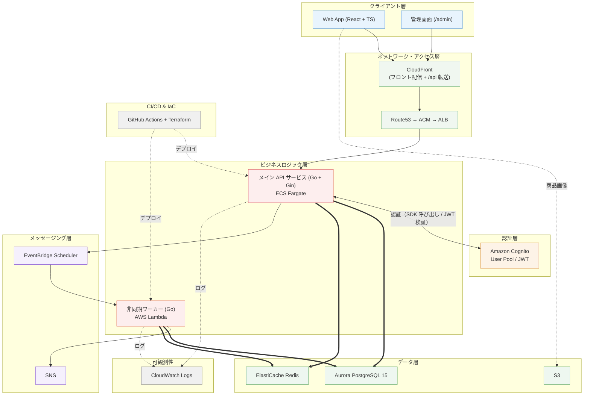

# 🏗️ FlashBuy — 大量同時アクセス対応 フラッシュセール・抽選販売プラットフォーム

[日本語] | [中文](README_zh.md)

> 高負荷・大量同時アクセスを想定したフラッシュセール（先着購入）と抽選販売のプラットフォームです。技術検証のポイントは 3 つ：Redis Lua によるアトミックな在庫減算（超売り防止）、抽選開票の Lambda バッチ処理、Terraform による AWS インフラの管理です。

---

## 1. システム全体アーキテクチャ図



> 注：上図は目標アーキテクチャです。
>
> 図中の Aurora は今後の移行先で、現在は **RDS PostgreSQL** を使用しています（選定理由は §5.1）。フロントは CloudFront から配信し（静的ホスティング + `/api` を ALB へ転送）、Route53 / ACM は今後追加する部分です。抽選開票や注文タイムアウトなどのバッチ処理は Lambda が担当します（設計は §6）。商品画像は S3 に保存します。

---

## 2. 技術スタック

### 2.1 フロントエンド

- **Core**: React 19, TypeScript, Vite
- **Styling**: Vanilla CSS, Tailwind CSS
- **State & Data**: Zustand, TanStack Query (React Query)
- **Utilities**: Day.js, Axios

### 2.2 バックエンド (Go)

- **Framework**: Go 1.26, Gin
- **Database Access**: sqlx, PostgreSQL（現在は RDS PostgreSQL、今後 Aurora へ移行。§5.1 参照）
- **Cache & Storage**: go-redis/v9（Redis Lua によるアトミック操作）
- **AWS Integration**: aws-sdk-go-v2
- **Logging**: Zap（構造化ログ）

### 2.3 クラウド・インフラ (AWS)

- **Compute**: ECS Fargate（常駐 1 台。拡張分は Spot）, AWS Lambda (Go Runtime)
- **Database & Cache**: PostgreSQL（**現在：RDS** / 今後：Aurora Serverless v2、§5.1 参照）, ElastiCache Redis
- **Storage & Lifecycle**: S3（商品画像。ライフサイクル階層化は §5 参照）
- **Messaging & Event**: SNS Standard（発行にタイムアウトを設定、失敗時は警告のみ）, EventBridge Scheduler
- **Network & Security**: ALB（CloudFront からのみ受け付け）、Amazon Cognito；Route53 / ACM / WAF は今後追加する項目です（§5 参照）
- **Deployment & Monitoring**: ECS ローリングデプロイ（100% / 200%、デプロイサーキットブレーカー有効）, CloudWatch（メトリクス / アラーム / ダッシュボード）

### 2.4 IaC & CI/CD

- **Terraform**（モジュール分割。state は S3、ロックは S3 ネイティブの `use_lockfile`）
- **GitHub Actions**（ビルド / テスト / **タグ push で自動リリース** / Terraform plan。インフラの apply は人が実行します。§7 参照）
- **リリース用の認証**：OIDC で一時クレデンシャルを取得（長期キーは保存しません）+ パイプラインごとに最小権限のロール + 環境承認（dev は自動 / prod は人の確認）、§7 参照

---

## 3. コアデータフロー

### 3.1 フラッシュセール（先着購入）フロー

```
[ユーザー] 「今すぐ購入」をクリック
   ↓
[フロントエンド] リクエスト送信（処理中はボタンを無効化）
   ↓ POST /api/v1/flash/buy
[API - Gin]
   ① Cognito JWT を検証
   ② 販売期間を検証（starts_at / ends_at。期間外は即拒否）
   ③ Redis Lua でアトミックに在庫を減算（同期・超売り防止）
      ├─ 在庫不足 → 「売り切れ」を返す
      └─ 減算成功 → 続行
   ④ トランザクションで注文を書き込み (UNPAID, expires_at = now + 15min) + DB 在庫 -1
   ⑤ at(expires_at) のワンタイム Schedule を登録（失敗時はログのみ。cron がバックアップ）
   ⑥ { orderId, status: "QUEUED" } を返す
```

> **購入を同期にしている理由**：在庫の減算は Redis 単一スレッドの原子性に依存しており（超売り防止の基盤）、メッセージキューによる非同期処理にはできません。またユーザーは結果を即座に知る必要があり、非同期化はポーリングやプッシュの複雑さを招くだけです。注文タイムアウトの取消と在庫復元は独立したバッチ処理です（デプロイ形態は §6）。

### 3.2 抽選フロー

```
[EventBridge Scheduler] draw_at の時刻に発火（抽選の作成時にワンタイム Schedule を自動登録）
   ↓
[Lambda - LotteryDrawer]
   ① 応募一覧を読み込む
   ② crypto/rand で乱数を生成（math/rand は使用しない）
   ③ Fisher-Yates でシャッフル
   ④ 当選者を DB に書き込む（当選は UNPAID + 72 時間の pay_deadline、残りは LOST）
   ⑤ SNS イベントを発行 (lottery.drawn)
```

---

## 4. プロジェクト構造

```
flashbuy/
├── frontend/                       # React + TypeScript のフロントエンド
│   ├── src/
│   │   ├── components/             # 共通コンポーネント (TicketCard, PaymentMockModal, Countdown, OrderStatusModal, StockDots, layout)
│   │   ├── hooks/                  # カスタム Hook (useCountdown)
│   │   ├── pages/                  # 画面 (Home, FlashList, Flash, LotteryList, Lottery, Search, MyPage, Admin, Login, Register, Privacy)
│   │   ├── services/               # API 通信層 (api.ts, request.ts)
│   │   ├── stores/                 # Zustand 状態管理 (authStore, orderStore)
│   │   └── types/                  # TypeScript 型定義 (index.ts)
│   └── Dockerfile                  # フロントエンドのイメージ
├── api/                            # Go API 本体 (Gin)
│   ├── cmd/server/                 # エントリポイント (main.go)
│   ├── config/                     # 設定読み込み (viper)
│   ├── controllers/                # HTTP コントローラ (auth / flash+buy / lottery+apply / payment / admin / my / search / home / upload)
│   ├── middleware/                 # ミドルウェア (AuthRequired / RequireRole)
│   ├── models/                     # データモデル (db/json tag)
│   ├── pkg/                        # 共通パッケージ (cache / database / logger / response / auth / s3 / scheduler / task)
│   ├── router/                     # ルーティング定義
│   ├── Dockerfile / .dockerignore  # API イメージ（マルチステージビルド、ARM64）
│   ├── docker-compose.yml          # ローカルの Postgres + Redis
│   ├── init_db.sql                 # テーブル作成 + シードデータ（正本）
│   └── config-*.yaml(.example)     # ローカル / dev / クラウドの設定テンプレート（実ファイルはコミットしません）
├── lambdas/                        # AWS Lambda の非同期タスク（独立モジュール、build.sh で zip 化）
│   ├── lottery_drawer/             # 抽選開票（draw の純粋ロジック + handler + sns + schedule + build.sh）
│   └── order_expirer/              # 注文の期限切れ取消（at の正確な取消 + cron スキャン、テスト付き + build.sh）
├── terraform/                      # Terraform インフラ（ディレクトリごとに state を分離）
│   ├── state/                      # state の保管先（S3 + ロック）
│   ├── data/                       # VPC + RDS PostgreSQL + ElastiCache Redis
│   ├── auth/                       # Cognito User Pool + App Client
│   ├── shared/                     # GitHub Actions 用 OIDC Provider + Terraform plan 用ロール
│   ├── storage/                    # 商品画像の S3（公開読み取り + CORS）
│   ├── lambda/                     # Lambda + Scheduler + SNS
│   ├── frontend/                   # フロントのホスティング（S3 + CloudFront、/api 転送含む）
│   ├── monitoring/                 # 監視（CloudWatch アラーム + ダッシュボード + 通知）
│   └── compute/                    # ECR + ECS Fargate + ALB（ローリングデプロイ）
├── .github/workflows/              # CI/CD（7 本。§7 参照）
├── data_design.md                  # データベース設計とバックエンド設計
└── README.md / README_zh.md        # アーキテクチャの完成形（日中バイリンガル）
```

---

## 5. 設計判断とトレードオフ

| 項目 | 現在採用 | 今後の目標 | 判断理由 |
| :--- | :--- | :--- | :--- |
| **CDN / WAF** | CloudFront（フロント配信 + `/api` 転送） | + AWS WAF | エッジ流量が少ないため、WAF は導入せず構成を簡素化します |
| **ストレージ階層化** | S3 Standard（単一バケット） | Standard-IA / Glacier のライフサイクル | 画像量が少ないため、当面は階層化しません |
| **可観測性** | CloudWatch（メトリクス / アラーム / ダッシュボード + ログ 7〜14 日保持） | ビジネスメトリクス（EMF）+ AWS X-Ray | 常駐の監視ミドルウェア（Datadog / Mackerel / Grafana）は導入しません。PoC 規模では固定費と運用負荷に見合いません（§8 参照） |
| **デプロイ方式** | ECS ローリングデプロイ（100% / 200%） | + ブルー/グリーン | 本アカウントでは CodeDeploy が利用できません（サービス単位の制限）。ローリングデプロイは新タスクがヘルスチェックを通過してから旧タスクを停止するため、リクエストは落ちません。現規模では十分です |
| **SNS** | 開票結果のイベント通知（lottery.drawn） | 必要に応じて FIFO | 開票 Lambda が SNS でビジネスイベントを発行します。発行にはタイムアウトを設定し、失敗時は警告のみ。結果は DB を正とします |
| **データベース** | **RDS PostgreSQL** | Aurora Serverless v2 | §5.1 参照 |
| **Redis** | シングルノード | Cluster マルチノード | 現規模では単一ノードでロジックと性能の検証に十分です |
| **決済** | ステートマシンのモック | 実際の決済 API | 決済ステータス遷移（UNPAID → PAID → CANCELLED）のロジック検証に絞ります |

### 5.1 データベース選定：RDS PostgreSQL を採用した理由

| 観点 | Aurora Serverless v2 | RDS PostgreSQL（現在採用） |
| :--- | :--- | :--- |
| **伸縮性** | 0.5〜N ACU の自動スケール。フラッシュセールのピークに適します | 固定インスタンス。手動またはスケジュールでのスケールが必要 |
| **可用性** | マルチ AZ とリードレプリカが標準 | Multi-AZ の明示的な有効化が必要 |
| **互換性** | Aurora PostgreSQL 方言で個別差異がある | 完全に標準の PostgreSQL。移行情報と運用ノウハウが最も豊富 |
| **コスト** | 最低 0.5 ACU（約 $44/月）。アイドル時も課金 | `db.t4g.micro` などの小規模スペックが選びやすく、**無トラフィックでも低コスト** |
| **運用成熟度** | 比較的新しく、運用知見はまだ少ない | 標準 PostgreSQL。運用資料とツールチェーンが最も充実 |
| **適用シーン** | 負荷変動が激しい、AWS ネイティブな新規案件 | 負荷が予測可能、予算重視、安定性を優先する通常案件 |

**判断の根拠**：

- 現在インスタンス負荷はほぼゼロで、Aurora の最低 0.5 ACU の常駐課金（約 $44/月）は不要なコストです
- RDS は標準 PostgreSQL のため、既存の監視・バックアップ・移行ツールをそのまま利用できます
- フラッシュセールのピークはリザーブドインスタンスと手動／スケジュールスケールで対応できます。将来、予測不能なトラフィックスパイクが発生した場合に、Aurora Serverless v2 の自動スケールを再評価します

---

## 6. 非同期タスクのデプロイ形態（Lambda の位置づけ）

### 6.1 注文タイムアウトの取消 + 在庫復元

注文作成時に `expires_at` を書き込みます（フラッシュセール = 注文 + 15 分、抽選 = 当選 + 72 時間）。タイムアウト取消は 2 層構成です：正確な時刻での取消と、スキャンによるバックアップ。

**① 正確な時刻 — EventBridge Scheduler `at()`**

フラッシュセールの購入時にワンタイムの `at(expires_at)` Schedule を登録し、時刻が来たらその注文のみをトリガーします。

```
フラッシュセールの購入成功
    → at(expires_at) のワンタイム Schedule を登録（名前は expire-{orderId}。再登録で上書き）
    → OrderExpirer Lambda（mode=cancel）：注文を取消 + Redis/DB の在庫を復元
    → トリガー後、Schedule は自動削除
```

> **抽選でこの経路を使わない理由**：当選注文には `at()` の正確な取消を使用しません。開票 Lambda はプライベートサブネットにあり（NAT なし、Scheduler の VPC Endpoint もなし）、Lambda からインターネット経由で AWS API を呼ぶと SYN がドロップされ 60 秒のタイムアウトまで停止し、開票自体が失敗します。当選分のタイムアウトは下記の cron スキャンで処理します。支払期限は 72 時間あり、枠数制で在庫の即時復元も不要なため、分単位の遅延は許容できます。

**② バックアップ — EventBridge cron スキャン**

`at()` には登録漏れの可能性があります（登録失敗、Lambda 失敗、スケジュール異常）。そのため 1 分間隔の cron でスキャンして回収します：`WHERE status='UNPAID' AND expires_at < now() LIMIT 100`（部分インデックス `idx_*_orders_expire` にヒット。1 回の件数を制限して負荷を抑えます。抽選側の条件は `pay_deadline`）。漏れた注文は遅くとも次のスキャンで回収されます。

| 設計ポイント | 実装 |
| :--- | :--- |
| 冪等性 | 取消 SQL はすべて `status='UNPAID'` と `expires_at < now()` の 2 条件付きで、`UPDATE ... RETURNING` により在庫 ID をアトミックに取得します。複数回実行しても二重取消・二重復元は発生しません |
| 在庫復元 | Redis は Lua による条件付き復元（キーが存在する場合のみ INCR。存在しなければ作成しない）を行い、同時に DB の stock を復元します。Redis に到達できない場合は DB のみ復元し、次のスキャンで補完します |
| ローカル環境 | `expirer_function_arn` が未設定の場合（ローカル / Lambda 未デプロイ）、API 内の goroutine（1 分間隔）が同じスキャンを実行します。空白期間を作らないためです |

### 6.2 抽選開票（Lottery Drawer）

| 特徴 | 説明 |
| :--- | :--- |
| トリガー時刻が明確 | 抽選商品ごとの `draw_at` に EventBridge Scheduler が発火します |
| 即時応答が不要 | ユーザーは結果を待たない純粋なバックグラウンド処理です |
| 実行時間が短い | `lottery_orders` から N 件ランダムに取得するだけなので数秒で完了し、Lambda の 15 分上限には遠く及びません |
| 商品ごとに独立してスケジュール | 抽選商品を作成するたびにワンタイム Schedule を登録するため、互いに干渉しません |

**① 正確な時刻 — EventBridge Scheduler `at()`**

```
抽選商品を作成（Admin API）
    → 同時に EventBridge Scheduler CreateSchedule を呼び出す（同名時は Update で上書き）
    → draw_at の時刻に 1 回だけ発火
    → Lambda が実行（mode=draw）：lottery_orders から winner_count 件をランダムに UNPAID へ、残りを LOST へ
    → トリガー後、Schedule は自動削除
```

**② バックアップ — EventBridge cron スキャン**

ワンタイム Schedule は「登録」と「配信」の 2 段階です。登録失敗（IAM 権限、クォータ、パラメータ誤り）、配信失敗、Lambda 失敗のいずれかが発生すると、その抽選は開票されません。一方で管理画面は成功を返し、ユーザー側には「開票待ち」が表示されるだけです。

そこで 1 分間隔の cron でスキャンし、「`draw_at` を過ぎても `WAITING` の応募が残っている」抽選を取得します（`draw_at` 昇順、1 回につき最大 10 件）。

| 設計ポイント | 実装 |
| :--- | :--- |
| 冪等性 | 開票は「全 `WAITING` を LOST にした後、当選者のみを UNPAID に上書き」する手順です。`WAITING` が空の場合はそのまま返します。繰り返し実行しても結果は変わりません |
| 並行安全性 | `drawLottery` 内で `lottery_items` の行に `FOR UPDATE` を付与し、正確な時刻の経路とスキャンが重なった場合は直列化します。後から到着した側は `WAITING` が空になったことを検知して正常終了します |
| 失敗を波及させない | 1 件の開票が失敗してもログのみで残りを続行します。失敗分は `WAITING` のまま残るため、次回のスキャンで自動的に再試行されます |
| なぜ Scheduler ではなく Rules か | 周期スキャンは固定のバッチ処理なので、Terraform で EventBridge Rules として静的に定義します。`at()` は注文 / 商品ごとに実行時に作成する必要があり、NAT のある API 側から Scheduler API を呼ぶ形になります。どちらもサービス側からのプッシュ呼び出しで、Lambda に求められるネットワーク要件に違いはありません |

### 6.3 デプロイ形態のまとめ

| タスク | デプロイ形態 | 説明 |
| :--- | :--- | :--- |
| 注文タイムアウトの取消 + 在庫復元 | **EventBridge `at()` による正確な取消（フラッシュセールのみ）+ cron スキャン + Lambda**（`order_expirer`） | ① フラッシュセールは `at(expires_at)` で注文ごとに取消し、在庫を即時復元します。② 抽選の当選分と ① の漏れは cron が毎分回収します。2 つのトリガーは同一 Lambda が `mode` で振り分けます |
| 抽選開票 | **EventBridge `at()` による正確な開票 + cron スキャン + Lambda**（`lottery_drawer`） | ① `draw_at` で対象の抽選を 1 回だけトリガーし、即時開票します。② 上の行で失敗した抽選は cron が毎分回収します。2 つのトリガーは同一 Lambda が `mode` で振り分けます |

---

## 7. CI/CD

### 7.1 パイプライン一覧

| Workflow | トリガー | 内容 |
| :--- | :--- | :--- |
| `frontend.yml` | push（develop / main）、PR；paths `frontend/**` | `pnpm lint` → build → S3 へ同期 → CloudFront のキャッシュを削除。ブランチで対象環境を切り替えます |
| `api-ci.yml` | push（develop / main）、PR；paths `api/**` | `go build` / `vet` / `test` →（push develop のみ）ARM64 イメージをビルドして ECR ログインを検証。**push しない**（ECR に置くのはリリース版のみ） |
| `api-cd.yml` | **タグ push（`v*`）のみ** | ビルド / テスト → タグ名（例 `v1.2.3`）でイメージを push → タスク定義の新しいリビジョンを登録 → ECS サービスを切り替え、安定するまで待機 |
| `lambda-ci.yml` | push（develop / main）、PR；paths `lambdas/**` | 2 つの `build.sh`（内部で `go test` も実行）→ zip 成果物 |
| `lambda-cd.yml` | **タグ push（`v*`）のみ** | ビルド / テスト → `update-function-code` → `publish-version` → エイリアス `live` を切り替え |
| `terraform.yml` | **PR のみ**；paths `terraform/**` | `fmt -check` + matrix：`shared` / `data` / `auth` / `storage` / `lambda` / `compute` / `frontend` / `monitoring` に対して `init` / `validate` / `plan`（`-detailed-exitcode`。差分ありは失敗扱いにしません。`state` は backend 自体を作るモジュールのため対象外） |
| `ci-notify.yml` | **`workflow_run`**（上の 6 本の完了イベント） | 通知の集約：失敗で Issue を自動作成（既に開いていればコメント追記）、復旧で自動クローズ。`SLACK_WEBHOOK_URL` を登録すると Slack にも送信（§7.5 参照） |

### 7.2 ブランチと環境の対応関係

| ブランチ / イベント | フロントエンド | API / Lambda | Terraform |
| :--- | :--- | :--- | :--- |
| PR | ビルド検証 | build / test のみ | plan（各モジュール） |
| `develop` | development へデプロイ | デプロイしない（API はイメージ push のみ / Lambda はビルドのみ） | 実行しない |
| `main` | production へデプロイ（**人の承認が必要**） | デプロイしない | 実行しない |
| `v*` tag | — | **自動リリース（API + Lambda）** | — |

> **リリースには独立した 2 つのゲートがあります**：workflow のトリガー条件（`on.push.tags: v*`）と、GitHub Environments のデプロイ許可リストです。`development` はブランチ `develop` と**タグ `v*`** の両方を許可します（CD はタグをトリガーにするため、タグを許可しないと環境ルールで拒否されます）。`production` は `main` のみを許可し、人の承認を追加します。リリースのパイプラインを増やすときは両方の許可が必要です。

**インフラの apply は必ず人が実行します**：CI の役割は 2 つです。変更を先に見えるようにすること（plan）と、アプリケーション層を配ること（フロント / API / Lambda）。インフラの変更は、人が plan を確認してから実行します。

### 7.3 権限設計（3 層）

**① 長期キーを持たない（OIDC）**

GitHub Actions には AWS アクセスキーを保存せず、OIDC で一時クレデンシャルを取得します。パイプラインごとに**独立したロール**を持ち（フロントは環境ごとに dev / prod の 2 つ）、権限は対象リソースまで限定します。

| ロール | 権限範囲 |
| :--- | :--- |
| Lambda リリース | コード更新 / バージョン発行 / エイリアス切替。すべて対象の 2 関数とエイリアス `live` に限定 |
| API リリース | ECR push（対象リポジトリのみ）+ `RegisterTaskDefinition` / `UpdateService` / `Describe*`（対象のサービスとタスク定義のみ）。インフラ変更の権限は含みません |
| Terraform plan | 読み取り + state バケットの読み書き（書き込みと削除は `*.tflock` のみ）+ DB パスワードの Secret 1 件の読み取り |
| フロントのリリース（dev / prod） | 環境ごとに 1 ロール：S3 同期（対象のバケットのみ）+ CloudFront のキャッシュ無効化（対象のディストリビューションのみ） |

**② 環境ゲートと承認**

GitHub Environments がリリース方針を担います。`development` は参照ブランチの制限のみ、`production` は追加で人の承認が必要です。結果として開発フローは完全に自動化され、本番リリースには確認が 1 段入ります。

**③ トリガー側の防御**

公開リポジトリでは、フォークからの PR は**その PR 側の workflow 定義**で実行されます。workflow を書き換えてクレデンシャルを窃取される余地があるため、**クレデンシャルを持つ job は同一リポジトリからの PR に限定**します（`github.event.pull_request.head.repo.full_name == github.repository`）。

> 権限最小化（何ができるか）とトリガー制御（誰がどの条件で起動できるか）は同時に設計する必要があります。IAM を絞るだけでは不十分です。

### 7.4 リリース方式

**API（ECS）：タグを打てばリリース**

`v1.2.3` のようなタグを push すると `api-cd.yml` が自動で実行します：イメージをビルドして push（タグ名 + `latest`）→ 現在のタスク定義をコピーしイメージのみ差し替え → 新しいリビジョンを登録 → サービスを切り替え → 安定するまで待機。

- **バージョン番号はタグ名**。稼働中のバージョンはタスク定義のイメージタグで確認でき、SHA を控える必要はありません
- **環境変数は引き続き Terraform が管理**：CI は現在のリビジョンをコピーするため、env / secrets / ロールは自動的に引き継がれ、repo に二重定義する必要がありません
- **ロールバック**：`aws ecs update-service --task-definition flashbuy-api-dev:<旧リビジョン>`（秒単位）
- **デプロイサーキットブレーカー**を有効化：新タスクがヘルスチェックを連続で失敗した場合、前のリビジョンへ自動で戻ります
- 注意：Terraform で環境変数を変更した場合、次にタグを打つまで稼働中のサービスには反映されません（サービスの task definition は CI が切り替えるためです）

**Lambda：同じタグで一緒にリリース**

`lambda-cd.yml` が実行します：`build.sh`（テスト込み）→ `update-function-code` → `publish-version` → エイリアス `live` を新しいバージョンへ。

- トリガー（EventBridge Scheduler / Rules）は**エイリアス `live`** を呼ぶため、ロールバックは `aws lambda update-alias --function-name <名前> --name live --function-version <旧バージョン>`（秒単位）です
- バージョン番号は Lambda が採番します（発行番号）。どのタグに対応するかは Actions のログで確認します
- コードは CI がデプロイし、設定（メモリ / VPC / 環境変数）は Terraform が管理します（`ignore_changes` で分離）

**リリースタグの制約**：リリースのパイプラインは「タグが指すコミットが `main` 上にあるか」を検証します（`compare/main...<sha>` が `behind` / `identical` の場合のみ通過）。develop 上で未マージのコミットをリリースしてしまうことを防ぎます。

### 7.5 失敗時の通知

失敗通知は **`ci-notify.yml` が一元管理**します。`workflow_run` で全パイプラインの完了イベントを集約し、各パイプラインに通知処理を重複して書かないようにしています。

- **失敗** → Issue を自動作成。同じ Issue が開いている間は**コメントを追記**（乱立を防ぐ）
- **復旧** → その Issue を自動でクローズ
- リポジトリの Secret に `SLACK_WEBHOOK_URL` を登録すると**Slack にも送信**（任意。未登録なら Issue のみ）
- 注意：`workflows:` に書くのは各パイプラインの**表示名（`name:`）**です。改名時はここも直さないと、通知が静かに止まります

> GitHub の標準通知（リポジトリの CI activity を購読）も引き続き有効ですが、これは**その実行をトリガーした人にしか届きません**。Issue / Slack はチーム向けの補完で、両者は併用して問題ありません。

---

## 8. 監視とアラート

### 8.1 選定：CloudWatch ネイティブ

常駐の監視ミドルウェア（Datadog / Mackerel / Amazon Managed Grafana / 自前の Prometheus）は導入しません。PoC 規模では固定月額と追加コンポーネント（エージェント / sidecar / データソース設定）が必要になります。CloudWatch はメトリクス・ログ・アラーム・ダッシュボードを備えており、既存の IAM / ALB / ECS / RDS / Lambda と直接統合できます。

> Mackerel（はてな製）は国内 SaaS、Datadog も国内でよく利用されます。どちらもホスト単位の課金で、ECS 内にエージェントを動かす必要があり、現規模では不要です。

### 8.2 監視対象のメトリクス

| 層 | メトリクス | しきい値 | 監視理由 |
| :--- | :--- | :--- | :--- |
| ALB | UnHealthyHostCount | ≥ 1（2 期間連続） | 単一タスク構成のため、1 台の異常が全ユーザーに影響します |
| ALB | HTTPCode_Target_5XX_Count | ≥ 5 / 5 分 | アプリのバグ、DB 障害、デプロイ失敗が最初に現れる箇所です |
| ALB | TargetResponseTime | > 2 秒（5 分平均） | フラッシュセールのピーク時に在庫ロック待ちで応答が劣化します |
| ECS | CPUUtilization / MemoryUtilization | > 80%（2 期間連続） | タスクが上限に接近しています（OOM の前兆） |
| RDS | CPUUtilization | > 80% | データベース過負荷 |
| RDS | FreeStorageSpace | < 2 GB | 満杯になるとすべての書き込みが失敗します |
| RDS | DatabaseConnections | > 60 | コネクション枯渇の前兆 |
| ElastiCache | CPUUtilization | > 80% | 在庫減算の基盤です。劣化は購入速度に直接影響します |
| Lambda | Errors / Throttles（開票・期限切れ取消） | ≥ 1 | 開票が動作していない場合、画面は静かなためアラームでしか検知できません |

アラームは SNS トピックに集約し、メール購読は `alert_emails` 変数で指定します。

### 8.3 ダッシュボードとログ保持

- **ダッシュボード 1 枚**：ALB（リクエスト数 / 5xx / 応答時間 / 異常ターゲット）、ECS（CPU / メモリ）、RDS（CPU / 接続数）、Lambda（呼び出し / エラー）、ElastiCache —— 障害時に最初に確認する画面です
- **ログ保持**：ECS 7 日、Lambda 14 日。Lambda のロググループはサービスが自動作成すると**保持期間なし（永続保存）**になるため、明示的に作成して保持期間を設定します

### 8.4 今後：ビジネスメトリクス（EMF）

インフラのメトリクスは「システムが健全か」しか示せず、「ビジネスが正常か」は示せません。フラッシュセールと抽選で本来見るべきは業務の数値です：

- 購入成功 / 売り切れ拒否の件数（売り切れ率の異常 ⇒ 在庫プリヒートの問題、または異常トラフィック）
- 応募数・当選数・落選数（抽選の公平性を検証する材料）
- 注文タイムアウト取消数、在庫復元の失敗数
- Redis から DB へのフォールバック回数（`cache.Remember` の警告）

**EMF（Embedded Metric Format）** を使うと、構造化ログから直接メトリクスを生成できます。追加の API 呼び出しも追加費用も不要で、§6 の Lambda / ECS のログと直接つながります。

---

## 9. ライセンス

[MIT License](LICENSE)
