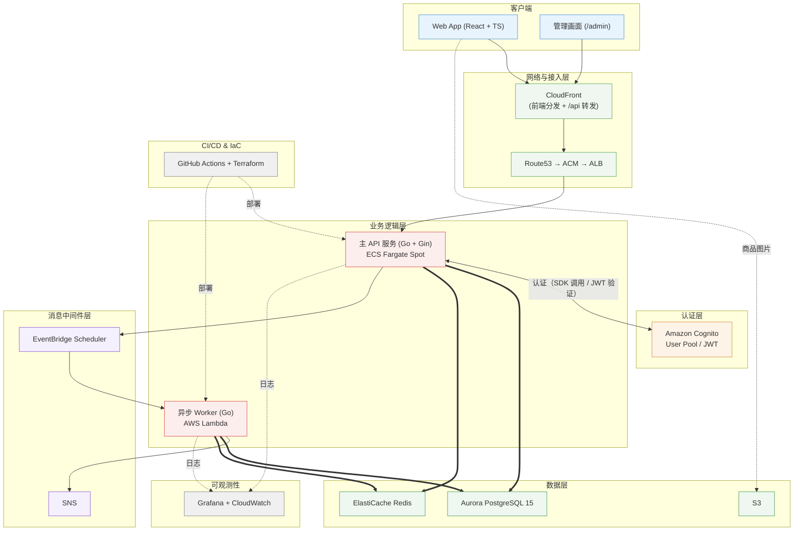

# 🏗️ FlashBuy — 高并发秒杀与抽签售卖平台

[日本語](README.md) | [中文]

> **项目概述**：本项目是一个针对高并发、高负载场景设计的抢购（Flash）与公平抽签（Lottery）综合售卖平台。核心技术验证点包括：基于 Redis Lua 脚本的原子库存扣减（防超卖）、抽签开奖的 Lambda 定时批处理、以及 Terraform 模块化 AWS 基础设施管理。

---

## 1. 系统整体架构图



> 注：上图为**目标架构**。
>
> 数据库：上图中的 Aurora 为**生产演进目标**；当前采用 **RDS PostgreSQL（provisioned）**，选型理由见 §5.1。前端经 CloudFront 分发（静态托管 + `/api` 转发至 ALB）；Route53 / ACM 为目标接入形态。异步 Worker（Lambda）承担抽选开奖、订单超时等批处理任务（设计见 §6）。S3 用于存储商品图片。

---

## 2. 技术栈清单

### 2.1 前端

- **Core**: React 19, TypeScript, Vite
- **Styling**: Vanilla CSS, Tailwind CSS
- **State & Data**: Zustand, TanStack Query (React Query)
- **Utilities**: Day.js, Axios

### 2.2 后端 (Go)

- **Framework**: Go 1.26, Gin
- **Database Access**: sqlx, PostgreSQL（当前 RDS PostgreSQL / 生产演进 Aurora，见 §5.1）
- **Cache & Storage**: go-redis/v9 (Redis Lua 脚本原子操作)
- **AWS Integration**: aws-sdk-go-v2
- **Logging**: Zap（结构化日志）

### 2.3 云服务与基础设施 (AWS)

- **Compute**: ECS Fargate Spot, AWS Lambda (Go Runtime)
- **Database & Cache**: PostgreSQL（**当前: RDS provisioned** / 生产演进: Aurora Serverless v2, 见 §5.1）, ElastiCache Redis
- **Storage & Lifecycle**: S3（商品图片；生命周期分级见 §5）
- **Messaging & Event**: SNS Standard, EventBridge Scheduler
- **Network & Security**: ALB, Route53, ACM, Amazon Cognito
- **Deployment & Monitoring**: CodeDeploy, CloudWatch, Grafana

### 2.4 IaC & CI/CD

- **Terraform** (模块化设计, S3 Remote State + S3 原生锁 `use_lockfile`)
- **GitHub Actions** (构建、测试、ECR 镜像推送、CodeDeploy 蓝绿部署、Terraform 部署)

---

## 3. 核心数据流

### 3.1 秒杀（抢购）链路

```
[用户] 点击“立即购买”
   ↓
[前端] 请求发送（按钮在处理中置为禁用）
   ↓ POST /api/v1/flash/buy
[API - Gin]
   ① Cognito JWT 身份校验
   ② Redis Lua 原子扣减库存（同步、防超卖）
      ├─ 库存不足 → 返回“已售罄”
      └─ 成功 → 继续
   ③ 事务写入订单 (UNPAID, expires_at = now + 15min) + DB 库存 -1
   ④ 注册 at(expires_at) 一次性 Schedule（失败仅记日志，cron 兜底）
   ⑤ 返回响应 { orderId, status: "QUEUED" }
```

> **同步设计依据**：下单链路保持同步完成，因为库存扣减必须依赖 Redis 单线程原子性（超卖防护的根基），无法通过消息队列延迟处理；且用户需要立即得知抢购结果，异步化只会引入轮询/推送的复杂度。订单超时取消与库存回补是独立的批处理任务，部署形态见 §6。

### 3.2 抽签链路

```
[EventBridge Scheduler] draw_at 到达时触发（创建抽选时自动注册一次性 Schedule）
   ↓
[Lambda - LotteryDrawer]
   ① 读取报名列表
   ② 使用 crypto/rand 生成安全随机数
   ③ Fisher-Yates 洗牌算法
   ④ 抽取中签者并批量写入 DB（中签 UNPAID + 72 小时 pay_deadline，其余 LOST）
   ⑤ 发布 SNS 事件 (lottery.drawn)
```

---

## 4. 项目目录结构

```
flashbuy/
├── frontend/                       # React + TypeScript 前端
│   ├── src/
│   │   ├── components/             # 通用组件 (TicketCard, PaymentMockModal, Countdown, OrderStatusModal, layout)
│   │   ├── hooks/                  # 自定义 Hook (useCountdown)
│   │   ├── pages/                  # 页面 (Home, FlashList, Flash, LotteryList, Lottery, Search, MyPage, Admin, Login, Register)
│   │   ├── services/               # API 通信层 (api.ts, request.ts)
│   │   ├── stores/                 # Zustand 状态管理 (authStore, orderStore)
│   │   └── types/                  # TypeScript 类型定义 (index.ts)
│   └── Dockerfile                  # 前端镜像
├── api/                            # Go API 主服务 (Gin)
│   ├── cmd/server/                 # 入口 (main.go)
│   ├── config/                     # 配置加载 (viper)
│   ├── controllers/                # HTTP 控制器 (auth / flash+buy / lottery+apply / payment / admin / my / search / home / upload)
│   ├── middleware/                 # 中间件 (AuthRequired / RequireRole)
│   ├── models/                     # 数据模型 (db/json tag)
│   ├── pkg/                        # 公共包 (cache / database / logger / response / auth / s3 / scheduler / task)
│   ├── router/                     # 路由定义
│   ├── Dockerfile / .dockerignore  # API 镜像（多阶段构建，ARM64）
│   ├── docker-compose.yml          # 本地 Postgres + Redis
│   ├── init_db.sql                 # 建表 + 种子数据（正本）
│   └── config-*.yaml(.example)     # 本地/dev/云配置模板（实文件不提交）
├── lambdas/                        # AWS Lambda 异步任务（独立 module，build.sh 出 zip）
│   ├── lottery_drawer/             # 抽选开奖（draw 纯逻辑包 + handler + sns + schedule + build.sh）
│   └── order_expirer/              # 订单过期取消（at 精确取消 + cron 扫表，含单测 + build.sh）
├── terraform/                      # Terraform 基础设施（各目录独立 state）
│   ├── state/                      # State 后端（S3 + 锁）
│   ├── data/                       # 数据层（VPC + RDS PostgreSQL + ElastiCache Redis）
│   ├── auth/                       # 认证层（Cognito User Pool + App Client）
│   ├── shared/                     # GitHub Actions OIDC
│   ├── storage/                    # 商品图片 S3（公开读 + CORS）
│   ├── lambda/                     # Lambda + Scheduler + SNS
│   ├── frontend/                   # 前端托管（S3 + CloudFront，含 /api 转发）
│   └── compute/                    # 计算层（ECR + ECS Fargate + ALB + CodeDeploy）
├── .github/workflows/              # CI/CD
├── data_design.md                  # 数据结构与后端设计文档
└── README.md / README_zh.md        # 架构蓝图（中日双语）
```

---

## 5. 架构决策与权衡（Trade-offs）

| 模块 | 当前采用 | 生产演进 | 权衡考量                                                   |
| :--- | :--- | :--- |:-----------------------------------------------------------|
| **CDN / WAF** | CloudFront（前端分发 + `/api` 转发） | + AWS WAF | 当前边缘流量小，WAF 省略以简化架构                 |
| **存储分级** | S3 Standard（单桶） | Standard-IA / Glacier 生命周期 | 图片量小，暂不做分级沉降 |
| **可观测性** | CloudWatch + Grafana | + AWS X-Ray | 当前结构化日志已满足追踪需求，暂不引入分布式追踪 |
| **SNS** | 开奖结果事件通知（lottery.drawn） | 视场景引入 FIFO | 异步 Worker（开奖 Lambda）通过 SNS 发布业务事件 |
| **数据库** | **RDS PostgreSQL（provisioned）** | Aurora Serverless v2 | 见 §5.1「数据库选型取舍」                                  |
| **Redis** | 单节点 | Cluster 多节点集群 | 当前规模下单节点已足够支撑逻辑与性能验证                   |
| **支付流程** | 状态机 Mock 模拟 | 真实第三方支付 API | 聚焦于支付状态机（UNPAID → PAID → CANCELLED）的链路逻辑验证  |

### 5.1 数据库选型取舍：RDS vs Aurora Serverless v2

| 维度 | Aurora Serverless v2 | RDS PostgreSQL（当前采用） |
| :--- | :--- | :--- |
| **伸缩性** | 0.5~N ACU 自动扩缩，适配秒杀波峰 | 固定实例规格，需手动/定时扩缩 |
| **高可用** | 原生多可用区 + 读副本 | 需显式开启 Multi-AZ |
| **兼容性** | Aurora PostgreSQL 方言，个别差异 | 完全标准 PostgreSQL，迁移/运维资料最多 |
| **成本** | 最低 0.5 ACU 起步（约 $44/月），闲置也计费 | `db.t4g.micro` 等小规格更可控，**无流量也低费** |
| **运维成熟度** | 较新，运维经验积累尚浅 | 完全标准 PostgreSQL，运维资料与工具链最丰富 |
| **适用场景** | 负载剧烈波动、AWS 原生新项目 | 负载可预测、预算敏感、追求稳定性的常规项目 |

**选型依据**：采用 **RDS PostgreSQL（provisioned）**：
- 当前实例负载接近零，Aurora Serverless v2 最低 0.5 ACU 的常驻计费（约 $44/月）带来不必要的成本开销
- RDS 为标准 PostgreSQL 形态，与既有运维体系（监控、备份、迁移工具）兼容性最好，工具链与运维方案最成熟
- 秒杀波峰场景的负载骤增可通过**预留实例 + 手动/定时扩缩**应对；若未来出现不可预测的流量尖峰，再评估 Aurora Serverless v2 的自动扩缩能力（其架构价值在于此场景）

---

## 6. 异步任务部署形态（Lambda 定位）

### 6.1 订单超时取消 + 库存回补

订单创建时写入 `expires_at`（秒杀 = 下单 + 15 分钟；抽选 = 中选 + 72 小时）。超时取消采用**两层结构**，兼顾"精确到点"与"可靠兜底"：

**① 本线（精确到点）— EventBridge Scheduler `at()`**

秒杀下单时注册一次性的 `at(expires_at)` Schedule，到点后只针对该笔订单触发 Lambda：

```
秒杀下单成功
    → 注册 at(expires_at) 一次性 Schedule（名称 expire-{orderId}，重注册覆盖）
    → OrderExpirer Lambda（mode=cancel）: 取消该订单 + 回补 Redis/DB 库存
    → 触发后 Schedule 自动删除
```

> **关于抽选**：中选订单**不走** `at()` 精确取消。开奖 Lambda 位于私有子网（无 NAT / 无 Scheduler VPC Endpoint），若在其中调用公网 AWS API 会 SYN 丢弃并挂起至 60s 超时，导致开奖本身失败。抽选中选的超时统一由下方的 cron 扫表兜底处理——其支付期长达 72 小时，且名额制无库存需即时回补，分钟级延迟完全可接受。

**② 兜底（扫表）— EventBridge cron**

`at()` 存在"注册失败 / Lambda 失败 / 调度异常"等漏配可能，故以 1 分钟周期的 cron 扫表回收：
`WHERE status='UNPAID' AND expires_at < now() LIMIT 100`（命中部分索引 `idx_*_orders_expire`，分批控制单次负载；抽选侧条件为 `pay_deadline`）。漏网的过期订单最迟在下一轮被回收。

| 设计点 | 说明 |
| :--- | :--- |
| 幂等 | 所有取消 SQL 带 `status='UNPAID'` + `expires_at < now()` 双条件，并以 `UPDATE ... RETURNING` 原子取回库存 ID——多轮触发、再试运行不会重复取消，也不会重复回补库存 |
| 库存回补 | Redis Lua 条件回补（key 存在才 INCR，不存在不造库存）与 DB stock 同步恢复；Redis 不可达时仅回补 DB 并由下轮扫描补齐 |
| 本地环境 | `expirer_function_arn` 未配置时（本地 / Lambda 未部署）由 API 内 goroutine（1 分钟间隔）承担同等扫表逻辑，避免空窗 |

### 6.2 抽选开奖（Lottery Drawer）

| 特征 | 说明 |
| :--- | :--- |
| 触发时机明确 | 每个抽选商品的 `draw_at` 时间点，由 EventBridge Scheduler 触发 |
| 无实时响应需求 | 用户不等待，纯后台批处理 |
| 运行时间有限 | 从 `lottery_orders` 随机抽 N 条，几秒内完成，远低于 Lambda 15min 上限 |
| 按商品独立调度 | 每创建一个抽选商品就注册一个一次性 Schedule，互不干扰 |

```
创建抽选商品（Admin API）
    → 同时调用 EventBridge Scheduler CreateSchedule（重名时 Update 覆盖）
    → 指定 draw_at 时间一次性触发
    → Lambda 执行: 随机选 winner_count 条 lottery_orders 改为 UNPAID，其余改 LOST
    → 触发后自动删除 Schedule
```

### 6.3 部署形态汇总

| 任务 | 部署形态 | 说明 |
| :--- | :--- | :--- |
| 订单超时取消 + 库存回补 | **EventBridge `at()` 精确取消（仅秒杀）+ cron 扫表（全量兜底）+ Lambda**（`order_expirer`） | ① 秒杀按 `at(expires_at)` 逐单取消（即时回补库存）；② 抽选中选单与 ① 的漏配订单由 cron 每分钟扫表回收；两类触发共用同一 Lambda，靠 `mode` 分发 |
| 抽选开奖 | **EventBridge `at()` + Lambda** | 按 draw_at 一次性触发，批处理，无常驻进程 |

---

## 7. 开源协议

[MIT License](LICENSE)
