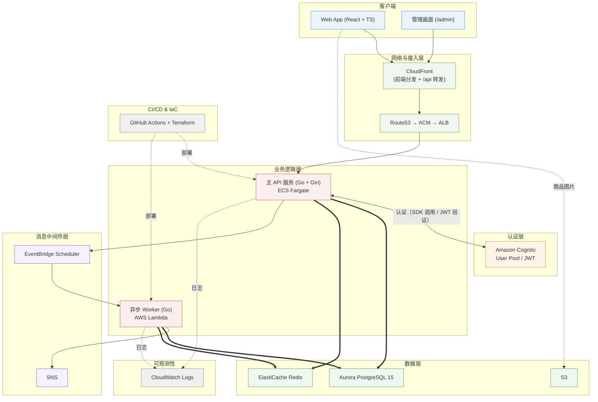

# 🏗️ FlashBuy — 高并发闪购与抽签售卖平台

[日本語](README.md) | [中文]

> 高并发、高负载场景下的闪购（Flash Sale）与抽签（Lottery）售卖平台。技术验证点有三个：Redis Lua 原子扣减库存防止超卖、抽签开奖的 Lambda 批处理、Terraform 管理 AWS 基础设施。

---

## 1. 系统整体架构图



> 注：上图是目标架构。
>
> 图中 Aurora 为后续迁移目标，当前使用 **RDS PostgreSQL**，选型理由见 §5.1。前端由 CloudFront 分发（静态托管 + `/api` 转发至 ALB），Route53 / ACM 是接入层后续要补的部分。抽签开奖、订单超时等批处理由 Lambda 承担（设计见 §6），商品图片存于 S3。

---

## 2. 技术栈

### 2.1 前端

- **Core**: React 19, TypeScript, Vite
- **Styling**: Vanilla CSS, Tailwind CSS
- **State & Data**: Zustand, TanStack Query (React Query)
- **Utilities**: Day.js, Axios

### 2.2 后端 (Go)

- **Framework**: Go 1.26, Gin
- **Database Access**: sqlx, PostgreSQL（当前为 RDS PostgreSQL，后续迁往 Aurora，见 §5.1）
- **Cache & Storage**: go-redis/v9（Redis Lua 原子操作）
- **AWS Integration**: aws-sdk-go-v2
- **Logging**: Zap（结构化日志）

### 2.3 云服务 (AWS)

- **Compute**: ECS Fargate（常驻 1 台，扩容部分使用 Spot）, AWS Lambda (Go Runtime)
- **Database & Cache**: PostgreSQL（**当前：RDS** / 后续：Aurora Serverless v2，见 §5.1）, ElastiCache Redis
- **Storage & Lifecycle**: S3（商品图片。生命周期分级见 §5）
- **Messaging & Event**: SNS Standard（发送带超时，失败仅告警）, EventBridge Scheduler
- **Network & Security**: ALB（仅接受 CloudFront 回源）、Amazon Cognito；Route53 / ACM / WAF 为后续补充项（见 §5）
- **Deployment & Monitoring**: ECS 滚动部署（100% / 200%，启用部署熔断）, CloudWatch（指标 / 告警 / 看板）

### 2.4 IaC & CI/CD

- **Terraform**（模块化拆分，state 存于 S3，锁使用 S3 原生 `use_lockfile`）
- **GitHub Actions**（构建 / 测试 / **打 tag 自动发布** / Terraform plan。基础设施的 apply 由人工执行，见 §7）
- **发布凭据**：OIDC 换取临时凭证（不保存长期密钥）+ 每条流水线一个最小权限角色 + 环境审批（dev 自动 / prod 需人工确认），见 §7

---

## 3. 核心数据流

### 3.1 闪购链路

```
[用户] 点击“立即购买”
   ↓
[前端] 发请求（处理中按钮置灰）
   ↓ POST /api/v1/flash/buy
[API - Gin]
   ① 校验 Cognito JWT
   ② 校验销售时间窗（starts_at / ends_at，非售卖期直接拒绝）
   ③ Redis Lua 原子扣减库存（同步，防超卖）
      ├─ 库存不足 → 返回“已售罄”
      └─ 扣减成功 → 继续
   ④ 事务写入订单 (UNPAID, expires_at = now + 15min) + DB 库存 -1
   ⑤ 注册 at(expires_at) 一次性 Schedule（失败仅记日志，由 cron 兜底）
   ⑥ 返回 { orderId, status: "QUEUED" }
```

> **为什么下单走同步**：扣减库存依赖 Redis 单线程的原子性（防超卖的基础），无法交由消息队列异步处理；用户也需要立即获得结果，异步化只会引入轮询或推送的复杂度。订单超时取消与库存回补属于独立的批处理，部署形态见 §6。

### 3.2 抽签链路

```
[EventBridge Scheduler] 到 draw_at 触发（创建抽选时自动注册一次性 Schedule）
   ↓
[Lambda - LotteryDrawer]
   ① 读取报名列表
   ② 使用 crypto/rand 生成随机数（不使用 math/rand）
   ③ Fisher-Yates 洗牌
   ④ 抽取中签者写入 DB（中签 UNPAID + 72 小时 pay_deadline，其余 LOST）
   ⑤ 发布 SNS 事件 (lottery.drawn)
```

---

## 4. 项目目录结构

```
flashbuy/
├── frontend/                       # React + TypeScript 前端
│   ├── src/
│   │   ├── components/             # 通用组件 (TicketCard, PaymentMockModal, Countdown, OrderStatusModal, StockDots, layout)
│   │   ├── hooks/                  # 自定义 Hook (useCountdown)
│   │   ├── pages/                  # 页面 (Home, FlashList, Flash, LotteryList, Lottery, Search, MyPage, Admin, Login, Register, Privacy)
│   │   ├── services/               # API 通信层 (api.ts, request.ts)
│   │   ├── stores/                 # Zustand 状态管理 (authStore, orderStore)
│   │   └── types/                  # TypeScript 类型定义 (index.ts)
│   └── Dockerfile                  # 前端镜像
├── api/                            # Go API 主服务 (Gin)
│   ├── cmd/server/                 # 入口 (main.go)
│   ├── config/                     # 配置加载 (viper)
│   ├── controllers/                # HTTP 控制器 (auth / flash+buy / lottery+apply / payment / admin / my / search / home / upload)
│   ├── middleware/                 # 中间件 (AuthRequired / RequireRole)
│   ├── models/                     # 数据模型 (db/json tag)
│   ├── pkg/                        # 公共包 (cache / database / logger / response / auth / s3 / scheduler / task)
│   ├── router/                     # 路由定义
│   ├── Dockerfile / .dockerignore  # API 镜像（多阶段构建，ARM64）
│   ├── docker-compose.yml          # 本地 Postgres + Redis
│   ├── init_db.sql                 # 建表 + 种子数据（正本）
│   └── config-*.yaml(.example)     # 本地/dev/云配置模板（实文件不提交）
├── lambdas/                        # AWS Lambda 异步任务（独立 module，build.sh 出 zip）
│   ├── lottery_drawer/             # 抽签开奖（draw 纯逻辑包 + handler + sns + schedule + build.sh）
│   └── order_expirer/              # 订单过期取消（at 精确取消 + cron 扫表，含单测 + build.sh）
├── terraform/                      # Terraform 基础设施（每个目录一份 state）
│   ├── state/                      # State 后端（S3 + 锁）
│   ├── data/                       # VPC + RDS PostgreSQL + ElastiCache Redis
│   ├── auth/                       # Cognito User Pool + App Client
│   ├── shared/                     # GitHub Actions 的 OIDC Provider + Terraform plan 用角色
│   ├── storage/                    # 商品图片 S3（公开读 + CORS）
│   ├── lambda/                     # Lambda + Scheduler + SNS
│   ├── frontend/                   # 前端托管（S3 + CloudFront，含 /api 转发）
│   ├── monitoring/                 # 监控（CloudWatch 告警 + 看板 + 通知）
│   └── compute/                    # ECR + ECS Fargate + ALB（滚动部署）
├── .github/workflows/              # CI/CD（7 条，见 §7）
├── data_design.md                  # 数据库设计与后端设计文档
└── README.md / README_zh.md        # 架构蓝图（中日双语）
```

---

## 5. 架构决策与取舍

| 模块 | 当前采用 | 后续目标 | 取舍理由 |
| :--- | :--- | :--- | :--- |
| **CDN / WAF** | CloudFront（前端分发 + `/api` 转发） | + AWS WAF | 边缘流量小，暂不引入 WAF 以简化架构 |
| **存储分级** | S3 Standard（单桶） | Standard-IA / Glacier 生命周期 | 图片量小，暂不做生命周期分级 |
| **可观测性** | CloudWatch（指标 / 告警 / 看板 + 日志保留 7–14 天） | 业务指标（EMF）+ AWS X-Ray | 不引入常驻监控中间件（Datadog / Mackerel / Grafana）：PoC 规模下固定成本与运维负担不划算。详见 §8 |
| **部署策略** | ECS 滚动部署（100% / 200%） | + 蓝绿部署 | 本账号无法使用 CodeDeploy（服务级限制）。滚动部署在新任务通过健康检查后才下线旧任务，不丢请求，当前规模足够 |
| **SNS** | 开奖结果事件通知（lottery.drawn） | 视场景引入 FIFO | 开奖 Lambda 通过 SNS 发布业务事件。发布带超时，失败仅告警，结果以 DB 为准 |
| **数据库** | **RDS PostgreSQL** | Aurora Serverless v2 | 见 §5.1 |
| **Redis** | 单节点 | Cluster 多节点 | 当前规模下，单节点足以支撑逻辑与性能验证 |
| **支付流程** | 状态机 Mock | 真实第三方支付 API | 聚焦支付状态流转（UNPAID → PAID → CANCELLED）的逻辑验证 |

### 5.1 数据库选型：采用 RDS PostgreSQL 的理由

| 维度 | Aurora Serverless v2 | RDS PostgreSQL（当前采用） |
| :--- | :--- | :--- |
| **伸缩性** | 0.5~N ACU 自动扩缩，适配闪购波峰 | 固定实例规格，需手动或定时扩缩 |
| **高可用** | 原生多可用区 + 读副本 | 需显式开启 Multi-AZ |
| **兼容性** | Aurora PostgreSQL 方言，存在个别差异 | 完全标准 PostgreSQL，迁移与运维资料最丰富 |
| **成本** | 最低 0.5 ACU（约 $44/月），闲置也计费 | `db.t4g.micro` 等小规格更可控，**无流量时成本极低** |
| **运维成熟度** | 较新，运维经验积累尚浅 | 标准 PostgreSQL，运维资料与工具链最丰富 |
| **适用场景** | 负载剧烈波动、AWS 原生新项目 | 负载可预测、预算敏感、追求稳定性的常规项目 |

**判断依据**：

- 当前实例负载接近零，Aurora 最低 0.5 ACU 的常驻计费（约 $44/月）是不必要的成本开销
- RDS 是标准 PostgreSQL，现成的监控、备份、迁移工具可直接使用
- 闪购波峰可通过预留实例与手动/定时扩缩应对。若今后出现不可预测的流量尖峰，再评估 Aurora Serverless v2 的自动扩缩能力

---

## 6. 异步任务的部署形态（Lambda 的定位）

### 6.1 订单超时取消 + 库存回补

订单创建时写入 `expires_at`（闪购 = 下单 + 15 分钟；抽签 = 中签 + 72 小时）。超时取消采用两层结构：精确到点 + 扫表兜底。

**① 精确到点 — EventBridge Scheduler `at()`**

闪购下单时注册一次性的 `at(expires_at)` Schedule，到点只触发该笔订单：

```
闪购下单成功
    → 注册 at(expires_at) 一次性 Schedule（名称 expire-{orderId}，重注册覆盖）
    → OrderExpirer Lambda（mode=cancel）：取消订单 + 回补 Redis/DB 库存
    → 触发后 Schedule 自动删除
```

> **抽签为什么不走这条**：中签订单不使用 `at()` 精确取消。开奖 Lambda 位于私有子网（无 NAT、无 Scheduler 的 VPC Endpoint），在 Lambda 内调用公网 AWS API 会 SYN 被丢弃并挂起至 60 秒超时，反而导致开奖失败。中签的超时统一由下方的 cron 扫表处理：支付期长达 72 小时，名额制也无需即时回补库存，分钟级延迟可以接受。

**② 兜底 — EventBridge cron 扫表**

`at()` 存在漏配可能（注册失败、Lambda 失败、调度异常），故以 1 分钟一次的 cron 扫描补偿：`WHERE status='UNPAID' AND expires_at < now() LIMIT 100`（命中部分索引 `idx_*_orders_expire`，限制单次条数以控制负载；抽签侧条件为 `pay_deadline`）。漏网订单最迟在下一轮被回收。

| 设计点 | 做法 |
| :--- | :--- |
| 幂等 | 取消 SQL 都带 `status='UNPAID'` 与 `expires_at < now()` 两个条件，再用 `UPDATE ... RETURNING` 原子取回库存 ID。多轮执行不会重复取消，也不会重复回补库存 |
| 库存回补 | Redis 用 Lua 条件回补（key 存在才 INCR，不存在不创建），同时恢复 DB stock；Redis 不可达时仅回补 DB，由下一轮扫描补齐 |
| 本地环境 | `expirer_function_arn` 未配置时（本地 / Lambda 未部署），由 API 内的 goroutine（1 分钟间隔）执行同样的扫表，避免空窗期 |

### 6.2 抽签开奖（Lottery Drawer）

| 特征 | 说明 |
| :--- | :--- |
| 触发时机明确 | 每个抽选商品有自己的 `draw_at`，由 EventBridge Scheduler 触发 |
| 无实时响应需求 | 用户不等待结果，纯后台批处理 |
| 运行时间有限 | 从 `lottery_orders` 随机抽 N 条，几秒完成，远低于 Lambda 15 分钟上限 |
| 按商品独立调度 | 每创建一个抽选商品就注册一个一次性 Schedule，互不干扰 |

**① 精确到点 — EventBridge Scheduler `at()`**

```
创建抽选商品（Admin API）
    → 同时调用 EventBridge Scheduler CreateSchedule（重名时 Update 覆盖）
    → 到 draw_at 触发一次
    → Lambda 执行（mode=draw）：随机选 winner_count 条 lottery_orders 改为 UNPAID，其余改为 LOST
    → 触发后 Schedule 自动删除
```

**② 兜底 — EventBridge cron 扫表**

一次性 Schedule 分为「注册」与「配信」两段：注册失败（IAM 权限、配额、参数错误）、配信失败、Lambda 失败——任一环节出错，该抽选都不会开奖，而管理端仍返回成功，用户侧只看到「开票待ち」。

因此用 1 分钟一次的 cron 扫描补偿，捞取「`draw_at` 已过但仍存在 `WAITING` 报名」的抽选（按 `draw_at` 升序，每次最多 10 件）：

| 设计点 | 做法 |
| :--- | :--- |
| 幂等 | 开奖逻辑为「先将全部 `WAITING` 置为 LOST，再仅将中签者覆盖为 UNPAID」；`WAITING` 为空时直接返回。重复执行结果不变 |
| 并发安全 | `drawLottery` 内对 `lottery_items` 行加 `FOR UPDATE`，精确触发与扫表重叠时串行化，后到者检测到 `WAITING` 已空即正常返回 |
| 单件失败不阻断 | 单件开奖失败仅记日志并继续处理其余，失败件保留 `WAITING`，下一轮自动重试 |
| 为什么用 Rules 而非 Scheduler | 周期扫描是固定的批处理，由 Terraform 以 EventBridge Rules 静态定义；`at()` 需按订单 / 商品在运行时创建，只能由有 NAT 的 API 侧调用 Scheduler API。两者都是服务侧推送调用，对 Lambda 的网络要求没有差别 |

### 6.3 部署形态汇总

| 任务 | 部署形态 | 说明 |
| :--- | :--- | :--- |
| 订单超时取消 + 库存回补 | **EventBridge `at()` 精确取消（仅闪购）+ cron 扫表 + Lambda**（`order_expirer`） | ① 闪购按 `at(expires_at)` 逐单取消并即时回补库存；② 抽签中签单与 ① 的漏网订单由 cron 每分钟回收。两类触发共用同一 Lambda，用 `mode` 分发 |
| 抽签开奖 | **EventBridge `at()` 精确开奖 + cron 扫表 + Lambda**（`lottery_drawer`） | ① 按 `draw_at` 一次性触发指定抽选并即时开奖；② 上一行失败漏掉的抽选由 cron 每分钟回收。两类触发共用同一 Lambda，用 `mode` 分发 |

---

## 7. CI/CD

### 7.1 流水线一览

| Workflow | 触发 | 内容 |
| :--- | :--- | :--- |
| `frontend.yml` | push（develop / main）、PR；paths `frontend/**` | `pnpm lint` → build → 同步 S3 → 刷新 CloudFront 缓存。分支决定目标环境 |
| `api-ci.yml` | push（develop / main）、PR；paths `api/**` | `go build` / `vet` / `test` →（仅 push develop）构建 ARM64 镜像并验证 ECR 登录，**不推送**（ECR 只放发布版镜像） |
| `api-cd.yml` | **仅 push tag（`v*`）** | 构建 / 测试 → 以 tag 名（如 `v1.2.3`）推送镜像 → 注册新的任务定义 revision → 切换 ECS 服务并等待稳定 |
| `lambda-ci.yml` | push（develop / main）、PR；paths `lambdas/**` | 两个 `build.sh`（内含 `go test`）→ zip 工件 |
| `lambda-cd.yml` | **仅 push tag（`v*`）** | 构建 / 测试 → `update-function-code` → `publish-version` → 切换别名 `live` |
| `terraform.yml` | **仅 PR**；paths `terraform/**` | `fmt -check` + matrix：对 `shared` / `data` / `auth` / `storage` / `lambda` / `compute` / `frontend` / `monitoring` 执行 `init` / `validate` / `plan`（`-detailed-exitcode`，有变更不算失败；`state` 用于创建 backend 自身，不在遍历范围内） |
| `ci-notify.yml` | **`workflow_run`**（上面 6 条的完成事件） | 汇总通知：失败自动开 Issue（已开着则追加评论）、恢复后自动关闭；注册 `SLACK_WEBHOOK_URL` 则同时发 Slack（见 §7.5） |

### 7.2 分支与环境的对应关系

| 分支 / 事件 | 前端 | API / Lambda | Terraform |
| :--- | :--- | :--- | :--- |
| PR | 构建检查 | 仅 build / test | plan（各模块） |
| `develop` | 部署至 development | 不部署（API 仅推送镜像 / Lambda 仅构建） | 不执行 |
| `main` | 部署至 production（**需人工审批**） | 不部署 | 不执行 |
| `v*` tag | — | **自动发布（API + Lambda）** | — |

> **发布有相互独立的两道闸门**：workflow 的触发条件（`on.push.tags: v*`）与 GitHub Environments 的部署白名单。`development` 同时放行分支 `develop` 与**标签 `v*`**（CD 以 tag 为触发源，不放行标签就会被环境规则拒绝），`production` 仅放行 `main` 并附加人工审批。新增发布流水线时两边都要放行。

**基础设施的 apply 一律由人工执行**：CI 只负责两件事——变更先可见（plan）与应用层发布（前端 / API / Lambda）。基础设施变更需人工确认 plan 后再执行。

### 7.3 权限设计（三层）

**① 不使用长期密钥（OIDC）**

GitHub Actions 不保存 AWS Access Key，通过 OIDC 换取临时凭证。每条流水线持有**独立角色**（前端按环境分为 dev / prod 两个），权限限定到具体资源：

| 角色 | 权限范围 |
| :--- | :--- |
| Lambda 发布 | 更新代码 / 发布版本 / 切换别名，全部限定在该两个函数与别名 `live` |
| API 发布 | ECR push（限定该仓库）+ `RegisterTaskDefinition` / `UpdateService` / `Describe*`（限定该服务与任务定义）。不含基础设施变更权限 |
| Terraform plan | 只读 + state 桶读写（写与删限定 `*.tflock` 锁文件）+ 单个 DB 密码 Secret 的读取 |
| 前端发布（dev / prod） | 每个环境一个角色：S3 同步（限定各自的桶）+ CloudFront 缓存失效（限定各自的分发） |

**② 环境门控与审批**

GitHub Environments 承担发布策略：`development` 仅限制来源分支，`production` 额外要求人工审批。因此开发流程完全自动，生产发布保留一道确认。

**③ 触发侧防护**

公开仓库中，fork 的 PR 会使用 PR 侧提交的 workflow 定义，存在借 workflow 窃取凭证的风险。因此**持有凭证的 job 限定只对同源 PR 执行**（`github.event.pull_request.head.repo.full_name == github.repository`）。

> 权限最小化（能做什么）与触发控制（谁能在什么条件下触发）必须同时设计，只收紧 IAM 并不足够。

### 7.4 发布方式

**API（ECS）：打 tag 即发布**

推送 `v1.2.3` 这样的 tag 后，`api-cd.yml` 自动执行：构建并推送镜像（tag 名 + `latest`）→ 复制当前任务定义、仅替换镜像 → 注册新 revision → 切换服务 → 等待稳定。

- **版本号即 tag 名**。线上运行的是哪个版本，查看任务定义的镜像标签即可，无需记录 SHA
- **环境变量仍由 Terraform 管理**：CI 复制的是当前 revision，env / secrets / 角色自动继承，无需在 repo 中重复定义
- **回滚**：`aws ecs update-service --task-definition flashbuy-api-dev:<旧 revision>`（秒级）
- 服务已启用**部署熔断**：新任务连续健康检查失败时自动退回上一版本
- 注意：Terraform 变更环境变量后，需要再打一次 tag 才会反映到运行中的服务（服务的 task definition 由 CI 切换）

**Lambda：同一个 tag 一起发布**

`lambda-cd.yml` 执行：`build.sh`（含测试）→ `update-function-code` → `publish-version` → 别名 `live` 指向新版本。

- 触发源（EventBridge Scheduler / Rules）调用的是**别名 `live`**，因此回滚为 `aws lambda update-alias --function-name <名称> --name live --function-version <旧版本>`（秒级）
- 版本号由 Lambda 自行编号（发布序号），对应哪个 tag 查看 Actions 日志
- 代码由 CI 部署，配置（内存 / VPC / 环境变量）仍由 Terraform 管理（以 `ignore_changes` 隔离）

**发布 tag 的约束**：release 流水线校验「tag 指向的提交位于 `main` 上」（比对 `compare/main...<sha>`，仅 `behind` / `identical` 通过），避免将 develop 上尚未合并的提交打成发布版本。

### 7.5 失败通知

失败通知由 **`ci-notify.yml` 统一承担**：用 `workflow_run` 汇总全部流水线的完成事件，避免在每条流水线里重复写通知逻辑。

- **失败** → 自动创建 Issue；同一 Issue 已开着时**追加评论**（避免刷屏）
- **恢复** → 该 Issue 自动关闭
- 注册仓库 Secret `SLACK_WEBHOOK_URL` 即可**同时发 Slack**（可选，未注册则只开 Issue）
- 注意：`workflows:` 里写的是各流水线的**显示名（`name:`）**；改名时必须同步这里，否则会静默失去通知

> GitHub 原生通知（订阅仓库的 CI activity）依然有效，但它**只发给触发该次运行的人**。Issue / Slack 是面向团队的补充，两者并存不冲突。

---

## 8. 监控与告警

### 8.1 选型：CloudWatch 原生

不引入常驻监控中间件（Datadog / Mackerel / Amazon Managed Grafana / 自建 Prometheus）。PoC 规模下，中间件会带来固定月费与额外组件（agent / sidecar / 数据源配置）；CloudWatch 已覆盖指标、日志、告警、看板，并与现有 IAM / ALB / ECS / RDS / Lambda 直接集成。

> Mackerel（はてな 制）是日本本土 SaaS，Datadog 在日本也很常见。两者都按主机计费，且需要在 ECS 内运行 agent，当前规模用不上。

### 8.2 监控指标一览

| 层 | 指标 | 阈值 | 监控理由 |
| :--- | :--- | :--- | :--- |
| ALB | UnHealthyHostCount | ≥ 1（连续 2 个周期） | 单任务构成，一台异常即影响所有用户 |
| ALB | HTTPCode_Target_5XX_Count | ≥ 5 / 5 分钟 | 应用 bug、DB 故障、部署失败都会先在这里出现 |
| ALB | TargetResponseTime | > 2 秒（5 分钟平均） | 闪购高峰时库存锁等待导致的响应劣化 |
| ECS | CPUUtilization / MemoryUtilization | > 80%（连续 2 个周期） | 任务接近上限（OOM 前兆） |
| RDS | CPUUtilization | > 80% | 数据库过载 |
| RDS | FreeStorageSpace | < 2 GB | 写满后所有写入失败 |
| RDS | DatabaseConnections | > 60 | 连接耗尽前兆 |
| ElastiCache | CPUUtilization | > 80% | 库存扣减的根基，劣化会直接拖慢下单 |
| Lambda | Errors / Throttles（开奖・过期取消） | ≥ 1 | 开奖未触发时界面是安静的，只能靠告警发现 |

告警统一发送到 SNS 主题，邮件订阅由 `alert_emails` 变量指定。

### 8.3 看板与日志保留

- **看板 1 个**：ALB（请求数 / 5xx / 响应时间 / 异常目标）、ECS（CPU / 内存）、RDS（CPU / 连接数）、Lambda（调用 / 错误）、ElastiCache —— 故障时优先查看的页面
- **日志保留**：ECS 7 天、Lambda 14 天。Lambda 的日志组若由服务自动创建则**无保留期（永久保存）**，故显式创建并设置保留期

### 8.4 后续：业务指标（EMF）

基础设施指标只能说明「系统是否健康」，说明不了「业务是否正常」。闪购 / 抽签真正需要关注的是业务数字：

- 下单成功 / 售罄拒绝的次数（售罄率异常 ⇒ 库存预热问题或异常流量）
- 报名数、中签数、落选数（抽签公平性的验证材料）
- 订单超时取消数、库存回补失败数
- Redis 降级到 DB 的次数（`cache.Remember` 的 warn）

使用 **EMF（Embedded Metric Format）** 从结构化日志直接产出指标：无需额外 API 调用，也不产生额外费用，与 §6 中 Lambda / ECS 的日志天然衔接。

---

## 9. 开源协议

[MIT License](LICENSE)
